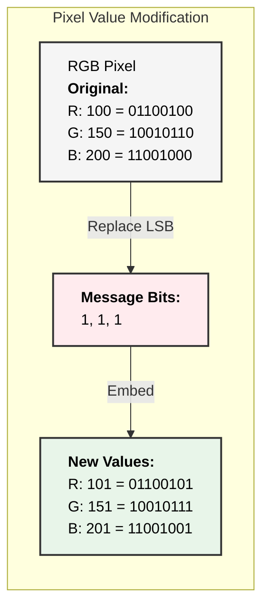

[](https://github.com/pranaykumar2/steg-go)

[](https://golang.org)
[](LICENSE)
[](https://github.com/pranaykumar2/steg-go/stargazers)

Steg-Go is a powerful command-line tool for hiding encrypted messages within images using Least Significant Bit (LSB) steganography and AES-256 encryption. Hide your secrets in plain sight with military-grade encryption! 🔒

## 🌟 Features

- **Steganography**: Hide messages imperceptibly in PNG or JPEG images
- **Strong Encryption**: AES-256 encryption for maximum security
- **Intuitive CLI**: Simple, user-friendly command-line interface
- **Format Support**: Works with PNG and JPG/JPEG input images
- **Data Integrity**: Preserves message integrity throughout the process

## 📦 Installation

## ▶️ Run It on Replit

Want to try Steg-Go without installing anything? Click the button below to run it instantly on Replit.

[](https://replit.com/github/pranaykumar2/steg-go)


### From Source

```bash
# Clone the repository
git clone https://github.com/pranaykumar2/steg-go.git
cd steg-go

#Change the permission to executable
chmod +x build.sh

# Build the application
./build.sh

# Run the application
./stego info
```

### Prerequisites

- Go 1.21 or higher

## 🚀 Usage

### Hide a Secret Message

```bash
./stego hide
```

**Example Session:**
```yaml
╔══════════════════════════════════════════╗
║      Secure Image Steganography Tool     ║
╚══════════════════════════════════════════╝
Current Time (UTC): 2025-03-01 09:41:34
User: runner

➜ Enter input image path (PNG or JPG): 
sample.jpg

➜ Enter output image path (will be saved as PNG): 
sample-hidden

➜ Enter the secret message: 
This is a top secret message!

ℹ Processing image...
✓ Message hidden successfully!
ℹ Encryption key (save this!): 5e365d1e972297e6f6b028a6720385a1ccf126463a111537687aa1713024c4c6
```

### Extract a Hidden Message

```bash
./stego extract
```

**Example Session:**
```yaml
╔══════════════════════════════════════════╗
║      Secure Image Steganography Tool     ║
╚══════════════════════════════════════════╝
Current Time (UTC): 2025-03-01 09:42:04
User: runner

➜ Enter image path: 
sample-hidden.png

➜ Enter encryption key (hex): 
5e365d1e972297e6f6b028a6720385a1ccf126463a111537687aa1713024c4c6

ℹ Extracting message...
✓ Message extracted successfully!

Extracted message: This is a top secret message!
```

### Show App Information

```bash
./stego info
```

## 🛠️ How It Works

### Steganography (LSB Technique)

Steg-Go employs the Least Significant Bit (LSB) steganography technique:

1. Each pixel in an image has RGB color channels (values 0-255)
2. The tool modifies only the least significant bit of each color component
3. These modifications are imperceptible to the human eye
4. The message is bitwise distributed across the image

**Technical Visualization:**


The diagram below illustrates how Steg-Go modifies pixels to hide data:




### Encryption (AES-256)

Before embedding, messages are encrypted using AES-256 in GCM mode:

1. A random 32-byte key is generated
2. The message is encrypted with this key
3. Both the encrypted data and a nonce are embedded in the image
4. The same key is required for decryption

## 🔒 Security Considerations

- **Image Format**: Output images are saved as PNG to prevent data loss
- **Key Storage**: Always store your encryption key securely
- **Capacity**: Large images can hide larger messages
- **Visual Analysis**: The changes are invisible to the naked eye but could be detected by statistical analysis

## 🧪 Technical Details

### Core Components

| Component | Description |
|-----------|-------------|
| `cmd/stego` | Main application entry point |
| `internal/steganography` | Handles hiding and extracting data |
| `internal/crypto` | Manages encryption and decryption |
| `pkg/imageprocessing` | Processes and manipulates image data |
| `internal/ui` | Command-line user interface |

### Process Flow


The diagram above illustrates Steg-Go's processing pipeline:


## 📝 License

This project is licensed under the MIT License - see the LICENSE file for details.

## 👥 Contributing

Contributions are welcome! Please feel free to submit a Pull Request.

1. Fork the repository
2. Create your feature branch (`git checkout -b feature/amazing-feature`)
3. Commit your changes (`git commit -m 'Add some amazing feature'`)
4. Push to the branch (`git push origin feature/amazing-feature`)
5. Open a Pull Request

## 📸 Before and After Comparison

| Original Image | Image with Hidden Message |
|----------------|---------------------------|
|  |  |

*Note: The images appear identical, demonstrating the effectiveness of LSB steganography.*

---

Created with ❤️ by [pranaykumar2](https://github.com/pranaykumar2)
