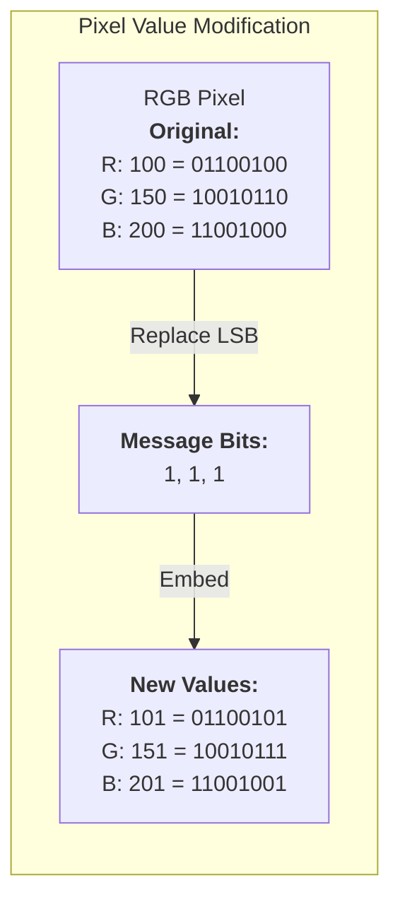

[](https://github.com/pranaykumar2/steg-go)

<p align="center">
  <a href="https://golang.org"></a>
  <a href="LICENSE"></a>
  <a href="https://github.com/pranaykumar2/steg-go/stargazers"></a>
</p>

---

## 🚀 **What is Steg-Go?**
🔒 **Steg-Go** is a powerful **command-line tool** that hides **encrypted messages inside images** using **Least Significant Bit (LSB) Steganography** and **AES-256 encryption**. Protect your sensitive data by embedding it imperceptibly in PNG/JPEG images!

---

## 🌟 **Features**
<p align="center">
  
  
  
</p>

✅ **Steganography**: Hide messages **imperceptibly** in PNG/JPEG images  
✅ **AES-256 Encryption**: Military-grade encryption for maximum security  
✅ **Intuitive CLI**: User-friendly, fast command-line tool  
✅ **Format Support**: Works with PNG and JPG/JPEG input images  
✅ **Data Integrity**: Ensures hidden data remains intact  

---

## 📦 **Installation**
### **🔧 From Source**
```bash
# Clone the repository
git clone https://github.com/pranaykumar2/steg-go.git
cd steg-go

# Change permissions to executable
chmod +x build.sh

# Build the application
./build.sh

# Run the application
./stego info
```

### **⚡ Prerequisites**
- **Go 1.21 or higher**

---

## ▶️ **Run It on Replit**
Want to try **Steg-Go** instantly without installation? Click below to launch on **Replit**.

[](https://replit.com/github/pranaykumar2/steg-go)

---

## 🚀 **Usage**
### **🔹 Hide a Secret Message**
```bash
./stego hide
```
📌 **Example Session:**
```yaml
╔══════════════════════════════════════════╗
║      Secure Image Steganography Tool     ║
╚══════════════════════════════════════════╝
Current Time (UTC): 2025-03-01 09:41:34
User: runner

➜ Enter input image path (PNG or JPG): 
sample.jpg

➜ Enter output image path (will be saved as PNG): 
sample-hidden.png

➜ Enter the secret message: 
This is a top secret message!

ℹ Processing image...
✓ Message hidden successfully!
ℹ Encryption key (save this!): 5e365d1e972297e6f6b028a6720385a1ccf126463a111537687aa1713024c4c6
```

---

### **🔹 Extract a Hidden Message**
```bash
./stego extract
```
📌 **Example Session:**
```yaml
➜ Enter image path: 
sample-hidden.png

➜ Enter encryption key (hex): 
5e365d1e972297e6f6b028a6720385a1ccf126463a111537687aa1713024c4c6

ℹ Extracting message...
✓ Message extracted successfully!

Extracted message: This is a top secret message!
```

---

## 🛠️ **How It Works**
### **🔹 Least Significant Bit (LSB) Steganography**
🖼️ **Steg-Go** modifies the **least significant bit** of each pixel's **RGB values** to hide messages:



### **🔹 AES-256 Encryption**
Before embedding, messages are **encrypted** using **AES-256**:

1. **Generate a random 32-byte key**
2. **Encrypt the message using AES-GCM**
3. **Embed both the encrypted data & nonce in the image**
4. **Same key is required for decryption**

---

## 🔒 **Security Considerations**
<p align="center">
  
  
  
</p>

✔ **Invisible Embedding**: Data is hidden at the **bit level**, undetectable to the **human eye**  
✔ **AES-256 Security**: Even if extracted, the message remains encrypted  
✔ **Lossless Image Format**: Output images are **PNG**, preventing **compression loss**  

---

## 🧪 **Technical Details**
| Component | Description |
|-----------|-------------|
| `cmd/stego` | Main application entry point |
| `internal/steganography` | Handles hiding and extracting data |
| `internal/crypto` | Manages encryption and decryption |
| `pkg/imageprocessing` | Processes and manipulates image data |
| `internal/ui` | Command-line user interface |

---

## 📸 **Before and After Comparison**
| Original Image | Image with Hidden Message |
|---------------|---------------------------|
|  |  |

🖼️ *Notice how the images appear identical? That's the power of LSB steganography!*

---

## 📝 **License**
This project is licensed under the **MIT License** - see the [LICENSE](LICENSE) file for details.

---

## 👥 **Contributing**
Contributions are **welcome**! Follow these steps to contribute:

1. **Fork** the repository  
2. **Create a feature branch** (`git checkout -b feature/amazing-feature`)  
3. **Commit your changes** (`git commit -m 'Add some amazing feature'`)  
4. **Push to the branch** (`git push origin feature/amazing-feature`)  
5. **Open a Pull Request**  

---

### 🎉 **Created with ❤️ by [pranaykumar2](https://github.com/pranaykumar2)**
