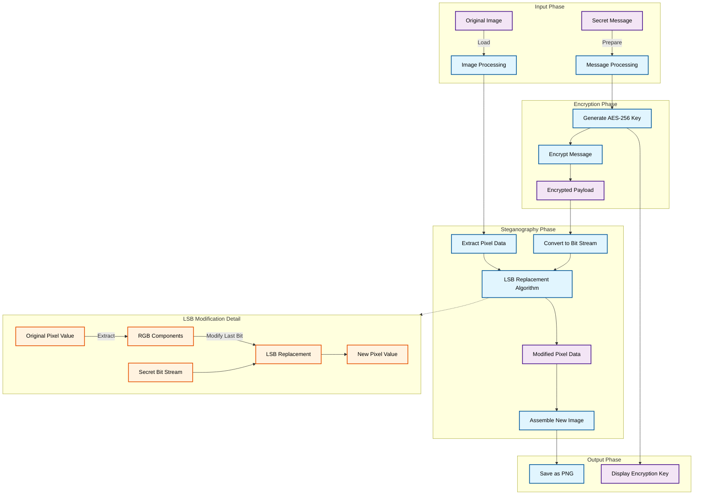
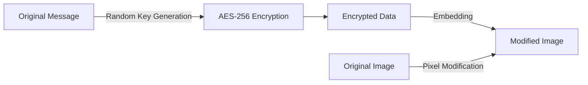

<div align="center">

<picture>
  <source media="(prefers-color-scheme: light)" srcset="logo/logo1.png">
  
</picture>

### *Secret Text Embedded Generates Output*

[](https://golang.org)
[](LICENSE)
[](https://github.com/pranaykumar2/steg-go/stargazers)
[](https://replit.com/github/pranaykumar2/steg-go)

</div>

---

## 🌟 What is Steg-Go?

**Steg-Go** is a powerful command-line tool that lets you **hide encrypted messages inside ordinary images**. Using advanced **Least Significant Bit (LSB) Steganography** combined with **AES-256 encryption**, it provides a secure way to conceal sensitive information in plain sight.

<div align="center">

### "If you want to keep a secret, you must also hide it from yourself." — George Orwell

</div>

---

## ✨ Key Features

<table align="center">
  <tr>
    <td align="center"></td>
    <td align="center"></td>
    <td align="center"></td>
  </tr>
  <tr>
    <td align="center"><b>Military-Grade Encryption</b></td>
    <td align="center"><b>Intuitive CLI</b></td>
    <td align="center"><b>Transparent Visual Quality</b></td>
  </tr>
  <tr>
    <td>AES-256 encryption ensures your data remains secure even if steganography is detected</td>
    <td>Simple, guided interface for both hiding and extracting data</td>
    <td>No visible changes to images — your secrets remain truly hidden</td>
  </tr>
</table>

### Security & Stealth

- ✅ **Undetectable to the human eye** - Modifies only the least significant bits
- ✅ **Double-layer protection** - Steganography + encryption
- ✅ **Format preservation** - Maintains image quality
- ✅ **Cross-platform** - Works on Linux, macOS, and Windows

---

## 🚀 Installation

<details>
<summary><b>📦 Unix/Linux/MacOS</b></summary>

```bash
# Clone the repository
git clone https://github.com/pranaykumar2/steg-go.git
cd steg-go

# Build and run
chmod +x build.sh
./build.sh
./stego info
```
</details>

<details>
<summary><b>🪟 Windows</b></summary>

1. **Install Go** from [golang.org/dl](https://golang.org/dl/)

2. **Clone the repository**
   ```cmd
   git clone https://github.com/pranaykumar2/steg-go.git
   cd steg-go
   ```

3. **Build the application**
   ```cmd
   go mod tidy
   go build -o stego.exe ./cmd/stego
   ```

4. **Run Steg-Go**
   ```cmd
   .\stego.exe info
   ```

<details>
<summary>💡 Windows Batch File (Optional)</summary>

Create `build.bat` with the following content:

```batch
@echo off
echo Building Steganography Tool - Initial Setup...

echo Tidying Go modules...
go mod tidy

echo Building application...
go build -v -o stego.exe ./cmd/stego

if %ERRORLEVEL% EQU 0 (
    echo Build successful! Run: .\stego.exe
) else (
    echo Build failed! Check for errors.
    exit /b 1
)
```

Run: `build.bat`
</details>
</details>

<details>
<summary><b>☁️ Try Online</b></summary>
  
No installation required! Try Steg-Go instantly:

[](https://replit.com/github/pranaykumar2/steg-go)
</details>

---

## 🎮 How to Use

<div align="center">
  
</div>

### Hide a Secret Message

```bash
./stego hide
```

<details>
<summary>📝 Example Session</summary>

```
╔══════════════════════════════════════════╗
║      Secure Image Steganography Tool     ║
╚══════════════════════════════════════════╝
Current Time (UTC): 2025-03-01 09:41:34
User: runner

➜ Enter input image path (PNG or JPG): 
sample.jpg

➜ Enter output image path (will be saved as PNG): 
sample-hidden.png

➜ Enter the secret message: 
This is a top secret message!

ℹ Processing image...
✓ Message hidden successfully!
ℹ Encryption key (save this!): 5e365d1e972297e6f6b028a6720385a1ccf126463a111537687aa1713024c4c6
```
</details>

### Extract a Hidden Message

```bash
./stego extract
```

<details>
<summary>📝 Example Session</summary>

```
➜ Enter image path: 
sample-hidden.png

➜ Enter encryption key (hex): 
5e365d1e972297e6f6b028a6720385a1ccf126463a111537687aa1713024c4c6

ℹ Extracting message...
✓ Message extracted successfully!

Extracted message: This is a top secret message!
```
</details>

---

## 🔍 The Magic Behind Steg-Go

### Complete Data Flow Process

The diagram below shows how Steg-Go transforms your secret message and embeds it invisibly into an image:



### How It Works

1. **Input Phase**: The original image and secret message are loaded and prepared
2. **Encryption Phase**: Your message is secured with AES-256 encryption
3. **Steganography Phase**: The encrypted data is embedded bit by bit into the image
4. **Output Phase**: The modified image is saved, looking identical to the original

The LSB (Least Significant Bit) modification detail shows exactly how each pixel is subtly altered to store your secret data without visible changes.

### LSB Steganography Explained

Steg-Go hides your data by modifying the least significant bit of each color channel in image pixels:

<table align="center">
  <tr>
    <th>Original Pixel</th>
    <th>Secret Bits</th>
    <th>Modified Pixel</th>
  </tr>
  <tr>
    <td>
      R: 100 (01100100)<br>
      G: 150 (10010110)<br>
      B: 200 (11001000)
    </td>
    <td align="center">
      1<br>1<br>1
    </td>
    <td>
      R: 101 (01100101)<br>
      G: 151 (10010111)<br>
      B: 201 (11001001)
    </td>
  </tr>
</table>

### AES-256 Encryption Flow



---

## 👀 See the Difference (or Not!)

<div align="center">
  <table>
    <tr>
      <td align="center"><b>Original Image</b></td>
      <td align="center"><b>Image with Secret</b></td>
    </tr>
    <tr>
      <td></td>
      <td></td>
    </tr>
  </table>

  <i>Can you spot the difference? Nobody can—that's the point!</i>
</div>

---

## 🧠 Technical Architecture

<div align="center">


</div>

| Component | Purpose |
|-----------|---------|
| `cmd/stego` | Entry point and command handling |
| `internal/steganography` | Core steganography algorithms |
| `internal/crypto` | Encryption and decryption logic |
| `pkg/imageprocessing` | Image manipulation utilities |
| `internal/ui` | User interface and interaction |

---

## 🛡️ Security Considerations

<div align="center">
  <table>
    <tr>
      <td width="33%" align="center"><b>Visual Security</b></td>
      <td width="33%" align="center"><b>Cryptographic Security</b></td>
      <td width="33%" align="center"><b>Format Security</b></td>
    </tr>
    <tr>
      <td>Changes to the image are imperceptible to human eyes and basic analysis tools</td>
      <td>Even if steganography is detected, the AES-256 encryption makes content unreadable without the key</td>
      <td>Output as PNG preserves all data bits, preventing compression losses that occur with JPEG</td>
    </tr>
  </table>
</div>

---

## 🤝 Contributing

Contributions make the open-source community amazing! Any contributions you make are **greatly appreciated**.

<div align="center">


</div>

1. **Fork** the project
2. **Create** your feature branch (`git checkout -b feature/AmazingFeature`)
3. **Commit** your changes (`git commit -m 'Add some AmazingFeature'`)
4. **Push** to the branch (`git push origin feature/AmazingFeature`)
5. **Open** a Pull Request

---

<div align="center">

## 📄 License

Distributed under the MIT License. See `LICENSE` for more information.

## 🙏 Acknowledgements

* Go Programming Language
* All the amazing contributors
* You, for checking out this project!

<br>

**Created with ❤️ by [pranaykumar2](https://github.com/pranaykumar2)**

<br>

[](https://github.com/pranaykumar2)
[](https://www.linkedin.com/in/iamypranay/)

</div>
